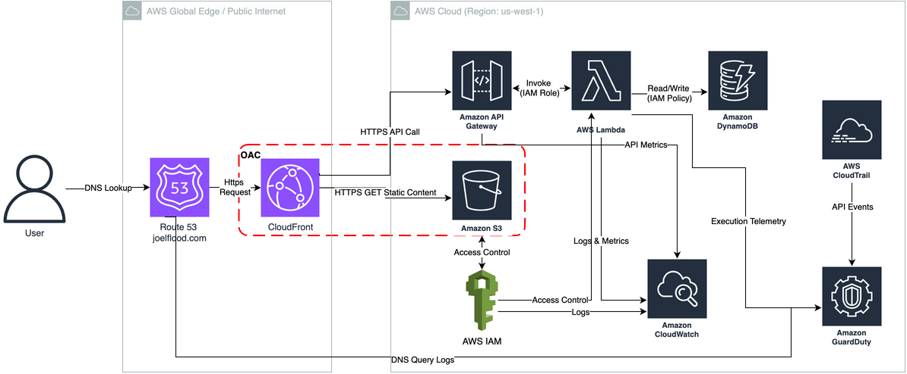

# Secure AWS Portfolio — Art & Professional Site

A secure, serverless personal website on AWS that combines an art portfolio with a professional resume page.  
The goal is to demonstrate end-to-end use of AWS cloud services while creating something personal, creative, technically sound, and security-minded.

---

## Overview

I’m building a responsive, static website hosted entirely in the AWS ecosystem.  
It highlights my artwork across multiple decades and includes a dedicated page for my professional background in **security, governance, risk, and compliance (GRC)**. 
The site consists of:
- **Art portfolio pages** organized by decade (1990s–2020s) and medium.
- A **Professional** page that includes my resume and links to LinkedIn and GitHub.
- A **serverless visitor counter** using Lambda, DynamoDB, and API Gateway.
- **CI/CD automation** for continuous deployment (future state).
- Documentation that ties technical implementation to **security and GRC principles**.
- Implementation of security controls including geo-blocking and enhanced security-header settings in CloudFront.

---

## Architecture Summary

The project follows a serverless architecture using AWS managed services:



| Layer             | AWS Service                                            | Purpose                                                                                                          |
| ----------------- | ------------------------------------------------------ | ---------------------------------------------------------------------------------------------------------------- |
| DNS               | **Route 53**                                           | Route traffic from endpoint to CloudFront                                                                        |
| Frontend          | **S3**                                                 | Host static HTML, CSS, and image assets                                                                          |
| Delivery          | **CloudFront**                                         | Provide HTTPS, global distribution, OAC to keep S3 bucket private, and caching                                   |
| Backend           | **API Gateway + Lambda**                               | Handle visitor counter logic                                                                                     |
| Database          | **DynamoDB**                                           | Store visitor count data                                                                                         |
| Access & Logging  | **IAM, CloudWatch, CloudTrail, GuardDuty**             | Security, monitoring, auditing, and passive threat detection                                                     |
| CI/CD             | **GitHub Actions** (future action)                     | Automate deployment to S3 and CloudFront invalidation                                                            |
| Backup & Recovery | **S3 Versioning, Glacier Deep Archive, DynamoDB PITR** | Protect static site assets and visitor counter with low-cost point-in-time recovery and archived object versions |

All services are configured with encryption, logging, and least-privilege IAM policies.  
The entire deployment aims to stay within AWS Free Tier and inexpensive services, with some nominal charges for services like Route 53 DNS routing.

---

## Repository Structure

```text
secure-aws-portfolio/
├── README.md                 # Project overview
├── project-plan.md           # Project plan and progress notes
├── diagrams/
│   └── architecture.png      # Architecture diagram
├── infrastructure/           # IaC templates for backend services (future)
│   └── visitor-counter.yml
├── resume-site/              # Static website
│   ├── robots.txt			  # Block "/images/" from search engines	
│   ├── sitemap.xml
│   ├── about.html
│   ├── 1990s.html
│   ├── 2000s.html
│   ├── 2010s.html
│   ├── 2020s.html
│   ├── digital-media.html
│   ├── professional.html	  # Resume
│   ├── favicon-16.png
│   ├── favicon-32.png
│   ├── favicon.ico
│   └── assets/
│       ├── css/style.css
│       └── images/
│       └── js/main.js
└── docs/
    └── site-implementation.md  # Requirements and validation notes
```

---

## Goals

- Build and host a modern, responsive portfolio site on AWS.  
- Apply **serverless architecture** for scalability and low cost.  
- Implement **secure deployment and governance practices** aligned with ISO 27001 and NIST CSF principles.  
- Document architecture, design choices, and operational controls. 
- Secure website using AWS configurations - **block public access to S3**, implement **strict security headers and Cloud Security Policy (CSP)**, and apply CloudFront controls such as geo-restriction and HTTPS enforcement.
- Use **CI/CD** to make the site fully automated from GitHub to S3.  

---

## Progress Snapshot

- **Week 1:** Planned architecture, defined AWS services, created diagrams and base folder structure.  
- **Week 2:** Developed and tested site locally, configured S3 + CloudFront, and began backend setup (Lambda + DynamoDB).  
- **Week 3:** Implement security controls - strict CloudFront header security controls (CSP, HSTS, Permissions Policy), geo-restriction, and end-to-end HTTPS.
- **Week 4:** Connect visitor counter, GuardDuty, complete CI/CD pipeline, and document implementation in `/docs`.
---

## Local Testing

```bash
git clone https://github.com/JoelF-GRC/secure-aws-portfolio.git
cd secure-aws-portfolio/resume-site
open index.html
```

Update the visitor-counter `fetch()` URL in `main.js` (used on `professional.html`) once the API Gateway endpoint is deployed.

---

## Security & GRC Highlights

This project treats security as a design requirement, not an afterthought.

- S3 and DynamoDB encrypted by default.  
- IAM roles restricted to least privilege.  
- CloudFront serves content via HTTPS only, as well as security response headers
- CloudFront OAC is used to keep the S3 bucket fully private, enforce SigV4-signed origin requests, and ensure only CloudFront can access site content.
- CloudTrail and CloudWatch log key activity, and backups use S3 versioning + DynamoDB PITR for simple recovery. 
- CI/CD process maintains version control and traceability.
- Enabled GuardDuty for passive threat detection across IAM, Lambda, S3, and DNS; it sits outside the data flow and adds continuous monitoring with minimal cost.

---
## Challenges / Lessons Learned

### Security headers breaking the site
Once the site was live, I started tightening the CloudFront security headers (CSP, HSTS, Permissions-Policy, etc.). Everything had been working, but the hardening process immediately surfaced some issues:

- The **hamburger menu and footer script stopped working** because my CSP was blocking inline JavaScript.
- **Google Fonts** failed to load due to missing `style-src` and `font-src` allowances.
- The **image lightbox** broke on certain devices because `blob:` wasn’t permitted under `img-src`.
- A strict **Permissions-Policy** interfered with fullscreen behavior.

To fix this, I re-balanced the security settings so they stayed strong but didn’t block normal site behavior. That meant adjusting the CSP to allow the specific resources I actually use, adding support for Google Fonts, and cleaning up the Permissions-Policy. I also updated a couple of HTML/JS pieces so they would work properly under the more restrictive rules.
### Geo-blocking blocked external scanners
Another issue I ran into was with my CloudFront geo restrictions. I had intentionally limited the allowed countries, but this ended up blocking tools that test and grade security headers. For example, when using web-based scanning tool, the scans originated from a country I initially did not have included whitelist, so the test wouldn’t reach my site at all. I had to add the country to my small allowlist so the scanner could actually review my headers.

Overall, these were good reminders that security controls and application behavior have to align, and sometimes the tools you rely on for validation have their own requirements.
### **DNSSEC - Why I Disabled It**

I originally attempted to implement **DNSSEC** for additional domain integrity protection.  
However, during testing, DNSSEC caused **intermittent SERVFAIL errors** on validating resolvers (Cloudflare 1.1.1.1, some ISP DNS servers, and certain home routers).

Troubleshooting showed:

- The domain worked normally on non-validating resolvers
    
- Validating resolvers intermittently returned:  
    **“invalid SEP”**, **“bogus DNSKEY”**, or **SERVFAIL**
    
- Even with correct DS records, GoDaddy’s registrar backend failed to store the DS correctly, a known issue with external DNS providers and ECDSA keys
    
- This resulted in inconsistent availability, depending on the DNS resolver used by the end-user

Because this portfolio site must load reliably for all visitors, and DNSSEC is optional, I decided to disable DNSSEC at both Route 53 and the registrar.

**Lesson:** DNSSEC requires a fully aligned trust chain across the registrar, DNS host, and validating resolvers; if any link mishandles DS or DNSKEY records, the domain becomes intermittently unreachable. For personal sites, reliability outweighs the marginal security benefit.
### **CSP blocked the visitor counter**

My DynamoDB/Lambda visitor counter worked when calling the API directly, but always returned `n/a` on the live site. The issue turned out to be my strict CloudFront **Content Security Policy**. Because I hadn’t defined `connect-src`, the browser defaulted to:

`default-src 'self'`

This silently blocked all outbound `fetch()` calls, including the request to API Gateway. The fix was simply adding my API domain to `connect-src`:

`connect-src 'self' https://xxxxxxxxx.execute-api.us-west-1.amazonaws.com;`

After updating CSP and invalidating CloudFront, the counter worked immediately.

**Lesson:** strict CSP is great, but you must explicitly allow the domains your app needs.

---
The project mirrors the same principles I apply in enterprise security work—defense-in-depth, least privilege, secure defaults, observability, and continuous validation.

---

## References

- [Cloud Resume Challenge – AWS](https://cloudresumechallenge.dev/docs/the-challenge/aws/)
- [AWS Well-Architected Framework](https://aws.amazon.com/architecture/well-architected/)
- [Amazon S3 Static Website Hosting](https://docs.aws.amazon.com/AmazonS3/latest/dev/WebsiteHosting.html)
- [AWS Serverless Application Model (SAM)](https://aws.amazon.com/serverless/sam/)

---

**Joel Flood**  
San Diego, CA  
[LinkedIn](https://www.linkedin.com/in/joelflood/)